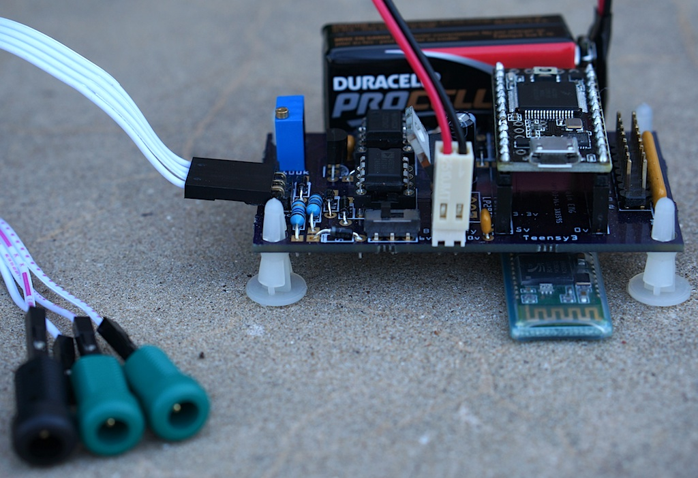

# Oscilloscope using Teensy or Arduino

Oscilloscopes provide a very useful tool for visualizing data. The Arduino and Teensy are inexpensive computers that can acquire data and transmit this information to a computer via the USB cable or Bluetooth. Why do we need another Arduino-based Oscilloscope? The links at the bottom of this page describe several alternatives, and a web search will reveal far more. My aim was to provide a solution that could provide a regular sampling rate, preserve the precision of the analog signal (10 bits for most devices, 16 bits for recent devices like the Teensy 3.0), provide wireless communication, and a digital input channel (for time stamps). None of the alternatives provide these features, so I created a simple format that acquires up to 15 channels. Details on the format are provided with the download. :::

I recommend using my code with the Teensy 2.0 and Arduino Leonardo (which use the Atmel Atmega32u4 CPU) or the Teensy 3.0 or Arduino Due (which use ARM CPUs). While my code will in theory work on [older Arduino devices](https://en.wikipedia.org/wiki/List_of_Arduino_boards_and_compatible_systems) those devices had very poor communication performance. For example, an Arduino Uno is limited to about only a single channel at 100 samples per second, where a Teensy 3 can easily send a dozen channels at 2000 samples per second. To use one of the older devices, you will need to slow down the communication speed (see the comments in my Matlab script for more details).

## Implementation

To use this, you will need a Teensy or Arduino with the Arduino software and some kind(s) or analog sensors. Sensors include twist knobs (potentiometers), [light](https://bildr.org/2011/06/temt6000_arduino/) sensors, [sound](https://www.sparkfun.com/products/9964) sensors, [temperature sensors](https://learn.adafruit.com/tmp36-temperature-sensor) , [strecth sensors](https://www.adafruit.com/product/519) , etc. You can attach up to 6 sensors -- to the devices' Analog 0...Analog 5 pins (or 14 devices on a Teensy 3, if you comment the line "//\#define ANALOG_KEYS"). The image on the right shows the simplest implementation: a Teensy 2.0 with the wiper of a potentiometer connected to Analog0 pin. The potentiometer bridges ground and the positive voltage (e.g. 5 volts for the Teensy 2), so the wiper voltage will vary between these two values depending on the knob position. Click [here for a similar example with an Arduino](https://www.arduino.cc/en/Tutorial/BuiltInExamples/AnalogInput/) . The [StimSync(https://github.com/hanayik/StimSync) board is an example of this setup -- with a pluggable sensor for Analog0 and a potentiometer for Analog1.

## Software Overview

Here is a brief description of the programs:

 - Arduino Software (to be loaded onto your Teensy or Arduino)
 - Acquisition Software: install stimsyncArd. You will want to start the Arduino software, open this sketch, and edit the lines of the sketch for your device (if you have a Teensy 3 you will want to uncomment "\#define IS_TEENSY3" and comment "//\#define IS_TEENSY2" as well as "\#define IS_LEONARDO"; for the Teensy 2 you want only IS_TEENSY2 uncommented, and for the Arduino Leonardo only IS_LEONARDO should be uncommented. Then install the sketch on your Arduino/Teensy.
 - Bluetooth_Programmer_Ard: This allows you to use an Arduino or Teensy to change the baud rate, name and passcode for a bluetooth module. This is important, as bluetooth modules ship with 9600bps -- by default this script changes this to 921600bps which is suitable for high speed communications (e.g. up to 3600 Hz with a3ch_interT3). This script is derived from openPilot, but with several key improvements (is able to detect original speed, is able to work on Teensy 3, etc). When you run this script, it resets the Bluetooth module and these changes are stored in the module's flash memory. When you run this script, select Tools/SerialMonitor from the Arduino software menu -- this will show you the progress. Once the program has run successfully, the bluetooth module should appear named "bt922k1234" and have the passcode 0000. Use this program to modify your bluetooth module and then upload stimsyncArd to allow the Teensy to work as a high speed wireless oscilloscope.
 - Display Software (for your macOS, Linux or Windows computer)
 - osciProcessing: [Processing code](https://www.processing.org/) that graphically displays the output of any of the above acquisition programs. This program extends Sofian Audry's work, decoupling acquisition speed from display rate (allowing much higher acquisition speeds).
 - ScopeMath_Arduino: A Matlab based oscilloscope that can view data and save recordings in BrainVision Analyzer format.
 - osciXCode: [XCode](https://developer.apple.com/xcode/) software for Macintosh macOS to graphically display the output of any of the above acquisition programs. This adds a graphical display for the open source code written by Andreas Mayer, Nick Zitzmann and Sean McBride. The graph uses Apple's elegant core graphics -- allowing you to export the plots in PDF format. Both compiled program and source code are provided.
 - osciLaz: this software allows you to graphically view and store data collected using any of the acquisition programs. The data is saved to disk in BrainVision Analyzer format, allowing you to analyze the data using many proprietary and open source tools, as described at my ELEcro web page. One other feature of this software is that displays two oscilloscopes: one shows the currently acquired data and the other shows data from the most recent trigger. You can use external triggers or define a threshold for one of your analog channels (so the trigger graph will show you a trace time-locked to a trigger being detected). The [Lazarus](https://www.lazarus-ide.org/) source code can be compiled for Windows, macOS and Linux. Precompiled executables for Windows and macOS are provided.

## Software Details: osciProcessing for Processing

osciProcessing is an oscilloscope for [Processing](https://processing.org/) extending an application by Sofian Audry. To run this software, do the following:

 -Make sure you have uploaded the acquisition software (e.g. > stimsyncArd) to your Arduino/Teensy. 
 -The first time you run this software: 
 -If you are using a Macintosh macOS computer you have to execute > the commands \"sudo mkdir -p /var/lock; sudo chmod 777 /var/lock\" > from a terminal application prior to running the processing code > for the first time. 
 -If you are running this software on a Linux computer, you probably > have to do something similar to what is required for macOS. When > you attempt to run the program for the first time, look at the > warnings displayed in the processing console window. This should > instruct you on what to do. 
 -If you are using a Teensy on a Windows computer, you will need to > install the [Windows drivers > first](https://www.pjrc.com/teensy/usb_serial.html) . In my > experience, the Windows software is not as fluid as on macOS (the > Teensy appears to deliver the data in large clusters of packets > followed by long pauses). 
 -Make sure the Arduino/Teensy is plugged into your computer. 
 -Launch [Processing](https://processing.org/) and use File/Open to > open the file osciProcessing.pde, then choose Sketch/Run 
 -A dialog box appears with a drop down menu, showing you the list > of available devices. Select the name of your Arduino/Teensy > (these typically appear as 'usbmodems' -- see the image on the > right). If your device does not appear, make sure you have the > Arduino/Teensy plugged in, that it is running the acquisition > software and that you have any required drivers installed. Once > you have selected your device, press 'OK' to accept your > selection. 
 -You should now see an oscilloscope. 
 -Note that the first few lines of the script allow you to specify > the sampling rate and the number of channels to record. 
 -Troubleshooting: if this does not work, please take a look at any > errors reported in the Processing console window.

## Software Details: stand-alone ScopeMath_Arduino for Matlab

ScopeMath_Arduino is a Matlab script that can run on Windows and Unix computers. It can save data to Brain Vision Analyzer format for offline analysis:

 - Launch Matlab 
 - Either change the current directory to the folder where the > ScopeMath_Arduino.m is or add this folder to the Matlab path. 
 - Run "ScopeMath_Arduino" from the Matlab command line 
 - A new window appears. You can use the pull down menus to select > the number of channels to record, the sampling rate, and to select > between different attached Arduino's (you can even select > 'Simulate data' if no Arduino is attached). 
 - Press 'Start Acquisition' to begin recording.

## Software Details: stand-alone ArduinoSerial for macOS

ArduinoSerial is an oscilloscope created using [Xcode](https://developer.apple.com/xcode/), it only runs on macOS Macintosh computers. To run this software, do the following:

  - Make sure you have uploaded the acquisition software (e.g. > a3ch_inter) to your Arduino/Teensy. 
  - Make sure the Arduino/Teensy is plugged into your computer. 
  - Launch the ArduinoSerial application. 
  - A dialog pull-down menu appears in the toolbar, showing you the > list of available devices. Select the name of your Arduino/Teensy > (these typically appear as 'usbmodems' -- see the image on the > right). If your device does not appear, make sure you have the > Arduino/Teensy plugged in, that it is running the acquisition > software and that you have any required drivers installed. Once > you have selected your device, press 'Connect' to accept your > selection. 
  - You should now see an oscilloscope.

## Software Details: stand-alone elecroRecord

elecroRecord is an oscilloscope created using [Lazarus](https://www.lazarus-ide.org/) , and can be compiled to run natively on Macintosh macOS, Windows and Linux computers. Currently, only a compiled macOS version is being distributed, but you can recompile the source code yourself for other operating systems. This software is currently of 'Alpha' quality, and should not be used with extreme caution. However, this software is also much more capable than the XCode and Processing code, including temporal filtering and recording data to the popular BrainVision Analyze format (so you can examine data with other software packages). To run this software, do the following:

  - Make sure you have uploaded the acquisition software (e.g. > a3ch_inter) to your Arduino/Teensy. 
  - Make sure the Arduino/Teensy is plugged into your computer. 
  - Launch the elecroRecord application. 
  - Choose File/StartRecording. A dialog box appears with several > options (see picture on left). 
  - A pull-down menu shows a list of available devices. Select the > name of your Arduino/Teensy (these typically appear as > 'usbmodems'). If your device does not appear, make sure you have > the Arduino/Teensy plugged in and the appropriate drivers are > available. 
  - Timeline Duration (ms): this sets the horizontal axis. For > example, if you set this to 1000, you will see the last seconds > worth of data on the screen whereas if you set this to 2000 the > last 2 seconds would be displayed. 
  - High pass filter (Hz): if set to zero, no filter is applied. Other > values filter the data, for example if you set this to 1, then > frequencies longer than 1 Hz are filtered out. If a high pass > filter is applied a constant signal will always appear to be zero > volts and you will only see high frequency transients. 
  - Trigger position: not yet implemented 
  - Save Digital Data as additional channel: if selected digital > information (e.g. button presses, electronic signals from other > devices) will be saved in the BrainVision data as a unique > channel, allowing you to determine the onset of these events > relative to the analog signals you recorded. 
  - Digital Trigger: if checked then digital inputs will be used to > detect a trigger sequences, otherwise an analog level will be > used. 
  - Analog Threshold: If the digital trigger selection is unchecked, > analog signals greater than this value will be counted as a > trigger signal. 
  - Automatically save data: if checked, data is automatically saved > when any recording stops. The set folder button allows you to > specify where these files will be saved. 
  - Calibrated output Custom check box: if checked, than you can > specify the precise range of the input signal, for example from > -50 to +50 millivolts. If unchecked the raw analog data is stored > (0..1023 for 10-bit devices, 0...65535 for 16-bit devices). If you > choose to store calibrated values, you should also specify the > range of the display range for the oscilloscope. For example if > you set the calibrated output to -50..+50 mV and the display range > to -5..+5 mV than the data stored to disk will show values ranging > from -50..+50mV, but the real time oscilloscope will zoom the > vertical axis to show only -5 to +5mV. This allows you to see > relatively small changes in the signal that use only a fraction of > the devices full dynamic range. For example, real EMG signals are > very small but TMS pulses generate very large (but irrelevant) > artifacts. 
  - Press the 'Start Recording' button to begin acquisition. 
  - You should now see an oscilloscope.

## Sample Application: Wireless oscilloscope

By default, you can use the USB cable to link your Arduino/Teensy device to the computer running the viewing software. However, it is easy to plug in a bluetooth module for wireless communication. I have used the $8 JY-MCU modules, though there are a lot of similar breakout boards. To wire this to a Teensy 3, simply connect VCC:Vin, GND:GND, TXD:RX1(pin0), RXD:TX1(pin1) -- the Teensy 3 signal pins are 3.3v which are perfect for the Bluetooth module. Look online for instructions for the Arduino and earlier Teensy models (note many of these devices use 5v signals so you may need a resistor). To test this circuit, the photo shows a 10K potentiometer with the wiper connected to A0 (pin 14) and the ends connected to ground and 3.3v (so that as you rotate the knob the signal will vary between 0 and 3.3v). These bluetooth modules come set to 9600bps, so use my Bluetooth_Programmer_T3 (if you have a Teensy 3) to change the bluetooth module to support 230400bps. You only need to run the script once -- whenever the bluetooth device restarts it will remember the new baud rate, passcode and name. You can now load the Acquisition Software onto your Arduino/Bluetooth -- my a3ch_interT3 script for the Teensy 3 supports bluetooth out of the box, and it is easy to adapt your scripts for [other devices](https://www.pjrc.com/teensy/td_uart.html) . Now you should be able to pair your computer with the bluetooth module and run any of the Display Software programs. The full oscilloscope script is pretty complex. 

If you want a simple script for binary communication between an Arduino, Arduino Due, Teensy 2 or Teensy 3, you can run the [Processing scipt](https://processing.org) included in this repository:

  - Run the osciProcessing.pde sketch. The Arduino will send a sample of byte at regular intervals. For example, by default it sends four bytes per sample (abcd abcd abcd...). The Processing script connects to the Arduino and sends the character 'b' to begin the data transmission. 
  - You can connect either to the Arduino USB port or the Bluetooth module.
  - The Arduino continuously streams the data and the Processing code reports the amount of data and reports any errors. 
  - When the user quits the Processing program, it sends the character 'e' to end data transmission.

## Sample Application: Electromyography (EMG) compatible with Transcranial Magnetic Stimulation (TMS)

Chip [Epstein](https://sites.google.com/site/chipstein/home-page/eeg-with-an-arduino/recording-eeg-or-ekg-with-an-arduino) describes how to turn the Arduino into a simple EMG or EEG system. My new software allows regular sampling intervals and extended precision, and Chip has cooked up some new hardware. We hope to describe our findings here soon.

Why create a new EMG system? We created this system to examine motor evoked potentials (MEPs) generated by brain stimulation (transcranial magnetic stimulation).

However, that device reports the rectified and smoothed data, which is not suitable for MEPs (and the capacitor may be disrupted by the TMS pulse). The [Olimex EKG-EMG shield](https://www.olimex.com/Products/Duino/Shields/SHIELD-EKG-EMG/) is another nice open source solution you can purchase. It is important to note that both the Advancer and Olimex solutions can be used with the software I describe above. This is particularly useful, as the closed-source Electric Guru software described on the Olimex web site is no longer available.

The TMSI Mobiis an outstanding professional solution -- recording 8 channels with high precision and reporting the data wirelessly. However, the Mobi is an expensive device.

For users interested in more channels and an amplifier capable of spanning the range from EMG, ECG to EEG you may want to visit our page describing how an Arduino or Teensy can interface with a ADS series front-end (ADS1294, ADS1296, ADS1298, ADS1299).

## Sample Application: Electroencephalography (EEG)

Chip [Epstein describes a simple Arduino based EEG system](https://sites.google.com/site/chipstein/home-page/eeg-with-an-arduino) . The software described here allows regular sampling rates as well as a way to save the data in the popular BrainVision format (so you can analyze it with other tools). The photo shows Chip's design implemented using a Teensy 2. This is great for students and hobbyists interested in EEG. [Olimex EEG-SMT](https://www.olimex.com/Products/EEG/OpenEEG/EEG-SMT/) also sells an EEG project. Please understand that most professional solutions will perform much better than these hobby projects.

## Sample Application: Pulse recording

Companies like [PulseSensor.com](https://pulsesensor.com/) sells= an elegant heart rate monitoring device. The image on the right shows the signal recorded from a finger. If you want, you can make a basic device using an [ambient light sensor](https://bildr.org/2011/06/temt6000_arduino/) and a light emitting diode. However, this device includes a temporal filter and really does work impressively well.

## Sample Application: Respiration monitoring

[Braebon](https://www2.braebon.com) sells Piezo Respiratory Effort Belts that generate small electrical currents as people breath in and out. These can be plugged into a standard electrophsyiological amplifier to provide very clean signals, and work very nicely with the EMG system we designed that I describe above. If you are on a budget, the [AdaFruit Stretch Sensor](https://www.adafruit.com/product/519) can be used with a voltage divider to record a signal directly from the Arduino analog port (without the need for a physiological amplifier). I have tried this solution, and it does work, though at first blush the signal does not look as clean as the professional Braebon solution and I am not sure if there is an inherent temporal lag in the signal.

## Sample Application: Electrocardiography (EKG)

[Olimex](https://www.olimex.com/Products/Duino/Shields/SHIELD-EKG-EMG/) sells an Arduino EKG/EMG shield. This shield can simply plug on top of an Arduino Leonardo to give nice performance. The image to the right shows a simple EKG measure.

## Technical details on precise timing

The stimsyncArd code uses interrupts to sample the data at very regular intervals. My software uses different routines for ARM based devices (Teensy 3, Due) and Atmel based devices (Teensy 2, Leonardo). You can view the code to see how it works. In general, it is very easy to program timers on the 32-bit ARM based CPUs. However, while a google search will find many descriptions of Atmel based timers (including [arduinodiy](https://arduinodiy.wordpress.com/2012/02/28/timer-interrupts/) ) they tend to be limited to a few specific frequencies and they tend to use Timer0 (which is 8-bit and is used by the main loop, so using this stops your main code. My code shows how to use Timer1 (a 16-bit timer) to set any frequency from 1Hz to 16Mhz at the optimal accuracy possible for a standard 16-Mhz Atmel CPU. While my code is simple, I have not seen this method implemented simply before, so hopefully others will find my code useful.

## Easter Egg: A USB Keyboard and digital outputs

When your Arduino/Teensy is not being controlled by oscilloscope software, it can be used as a standard USB keyboard. This allows you to use novel buttons (e.g. large buttons for people with motor impairment, small buttons for animals, electronic triggers for MRI scanners). You can also control digital outputs from EPrime or Matlab (see the included folders). A graphical program in the keymapLaz folder allows you to set the keyboard mapping. While running as a keyboard, the Arduino power light will remain on constantly, while in oscilloscope mode it blinks.

## Links

 - [Chip Epstein's EEG](https://sites.google.com/site/chipstein/home-page
/eeg-with-an-arduino/recording-eeg-or-ekg-with-an-arduino) system got me interested in this. 
 - [arduinoscope](https://code.google.com/p/arduinoscope/) is another branch of Sofian Audry's Processing-based oscilloscope. 
 - [lxardoscope](https://sourceforge.net/projects/lxardoscope/) is written in C, and has an elegant user interface. It records data with 8 bit precision. 
 - [Girino](https://www.instructables.com/Girino-Fast-Arduino-Oscilloscope/) is an oscilloscope that provides high temporal precision samples when a signal exceeds a trigger threshold. This is useful for many applications. The current version records 8 bit precision. 
 - [Arduin-O-Scope](https://forum.arduino.cc/index.php/topic,8077.0.html) is a tiny oscilloscope project. 
 - [xoscillo](https://code.google.com/archive/p/xoscillo/) is a C# (Windows) tool.
